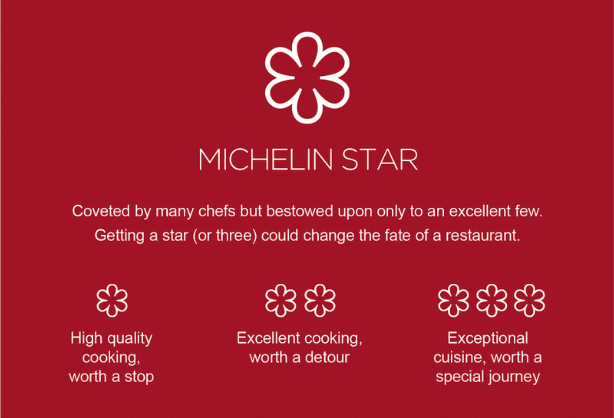

# Introduction 

Michelin stars are what every chef is looking for! Even the most renowned chefs will be worried about losing stars, and even cry after losing one or two stars. However, the majority of chefs are devoting their lives just for one star. It is obvious that Michelin stars are important for chefs, but the controversies around this guide always exist. 

---------------------------------------

# Contributors

Ziyu Chen 
[Personal Website](https://ziyu0303.github.io)

Huijun Xiao
[Personal Website](https://www.linkedin.com/in/huijun-xiao-290821159/)

Tina Zhao
[Personal Website](https://nz2333.github.io/p8105_hw4_nz2333.github.io/)

Xinyn Zhou
[Personal Website](https://sherry1953.github.io/index.html)

----------------------------------------------------------------------------------------

# Exploratory Data Analysis 

A baseline characteristics table and do some geographic comparison for the restaurants. - Xinyan  (EDA)

----------------------------------------------------------------------------------------

#  Cuisine Type and their Prices

We will also analyze the relationship between the cuisine types and prices, -Grace

----------------------------------------------------------------------------------------

# Cuisine Types and Michelin Stars
Cuisine types and star ratings of restaurants to see if there is an association between the variables. The analysis results will be delivered using graphs. -Tina

----------------------------------------------------------------------------------------

# Interactive Heat Map 

Using the latitude and longitude data available we will also plot a map showing the Michelin starred restaurant locations. -Claire 

